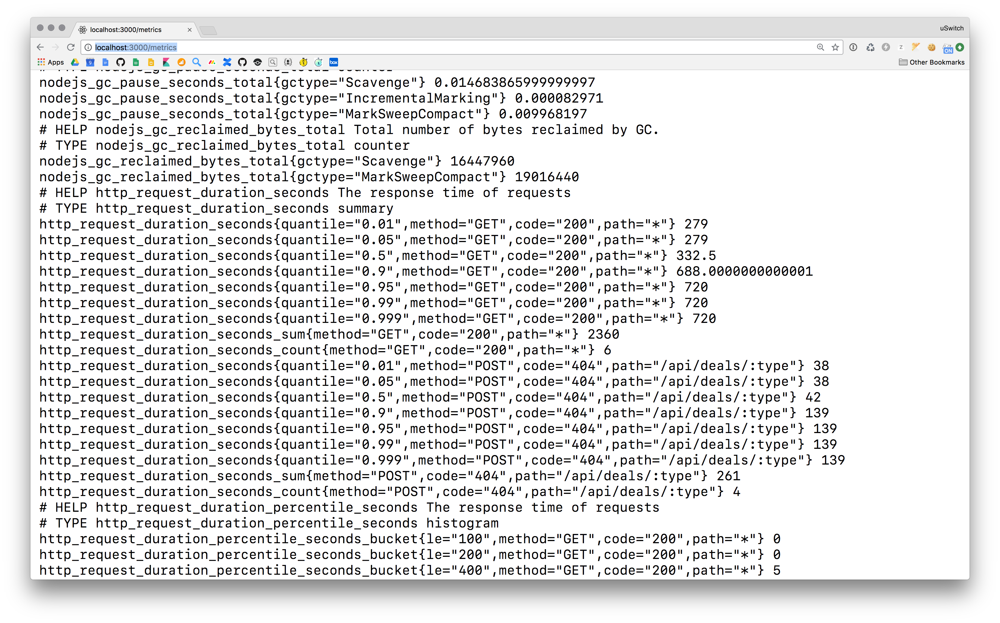

<h1 align="center">Koa Prometheus</h1>

<p align="center">
  <i>
    A configurable <b>Prometheus</b> data collector with <b>Koa</b> middleware
  </i>
</p>

<p align="center">
  <b><a href="#overview">Overview</a></b>
  |
  <b><a href="#usage">Usage</a></b>
  |
  <b><a href="#api">Api</a></b>
  |
  <b><a href="#configuration">Configuration</a></b>
  |
  <b><a href="#contributors">Contributors</a></b>
</p>


<p align="center">
  
</p>


[](#contributors)
[]()


[](https://facebook.github.io/jest/)
[](https://standardjs.com)

## Overview

This package is a thin wrapper around
[`prom-client`](https://github.com/siimon/prom-client) &
[`metrics`](https://github.com/mikejihbe/metrics), to provide
prometheus formatted metrics for **Koa** applications.

It provides the following types of metric;

* 📊 **Histogram** - Raw number counts, bucketed
* 📈 **Summary** - Percentile calculated buckets
* ⏱ **Meter** - an [EWMA](https://en.wikipedia.org/wiki/Moving_average#Exponential_moving_average) decaying gauge for counting over time
* 🌡 **Gauge** - A counter that can go both up and down
* 🎚 **Counter** - Count number of times something happens
* 🏷 **Labelling** - Labelling to enable powerful [Prometheus querying](https://prometheus.io/docs/prometheus/latest/querying/basics/)

It will also provide you with a `/metrics` endpoint to expose these
metrics to prometheus

---

### Usage

`koa-prometheus` is purely [_config
based_](https://github.com/uswitch/koa-prometheus/blob/master/src/koa-prometheus.schema.json)
and configurable, but you can attach it to your **Koa** service using
default metrics with the following;

```js
import Koa from 'koa'
import Meter from '@uswitch/koa-prometheus'

const app = new Koa()
const meters = Meter({ /* Config */ }, { loadDefaults: true })

app.use(meters.middleware)   // The middleware that makes the meters available
app.use(meters.route)        // The `/metrics` route to print metrics

app.on(eventAccess, (ctx) => meters.automark(ctx))
app.on(eventError, () => meters.errorRate.mark(1))

app.listen(3000, () => signal.start(Listening on port 3000))
```
<p align="center"><i><b>N.B.</b> See <a
href="https://github.com/uswitch/koa-core">
koa-core</a></i></p>

#### Purely config

The main philsophy of **Koa prometheus** is to provide a way to
configure the metrics, and how to collect them, in pure JSON. 

To do this, you can create a config file that contains a _list_ of
metrics, _.e.g_

```json
[
  // A manually invoked meter
  { 
    "name": "namespace_metric_name",
    "help": "A description of the metric",
    "type": "Counter"
  },
  // An `automark` meter
  {
    "name": "namespace_autocollected_metric",
    "help": "A description of the metric",
    "type": "Histogram",
    "labelNames": [
      { "key": "method", "path": ["path", "to", "method"] },
      { "key": "status", "path": ["path", "to", "status"] }
    ],
    "mark": { 
      "method": "observe",
      "path": [ "path","to","value" ]
    }
  }
]
```

See the
[`schema`](https://github.com/uswitch/koa-prometheus/blob/master/src/koa-prometheus.schema.json)
or the
[`defaults`](https://github.com/uswitch/koa-prometheus/blob/namespacing/src/koa-prometheus.defaults.json)
for a more detailed look at how they are configured.

### API

You get back the configured meter when you instantiate it, and you
will get

## Contributors

Thanks goes to these wonderful people ([emoji key](https://github.com/kentcdodds/all-contributors#emoji-key)):

<!-- ALL-CONTRIBUTORS-LIST:START - Do not remove or modify this section -->
| [<br /><sub>Dom Charlesworth</sub>](http://domcharlesworth.co.uk)<br />[📖](https://github.com/uswitch/koa-access/commits?author=domtronn "Documentation") [💻](https://github.com/uswitch/koa-access/commits?author=domtronn "Code") [🤔](#ideas-domtronn "Ideas, Planning, & Feedback") [🔌](#plugin-domtronn "Plugin/utility libraries") | [<br /><sub>David Annez</sub>](http://davidannez.com)<br />[💻](https://github.com/uswitch/koa-access/commits?author=annez "Code") [🤔](#ideas-annez "Ideas, Planning, & Feedback") [🔌](#plugin-annez "Plugin/utility libraries") |
| :---: | :---: |
<!-- ALL-CONTRIBUTORS-LIST:END -->

This project follows the [all-contributors](https://github.com/kentcdodds/all-contributors) specification. Contributions of any kind welcome!


