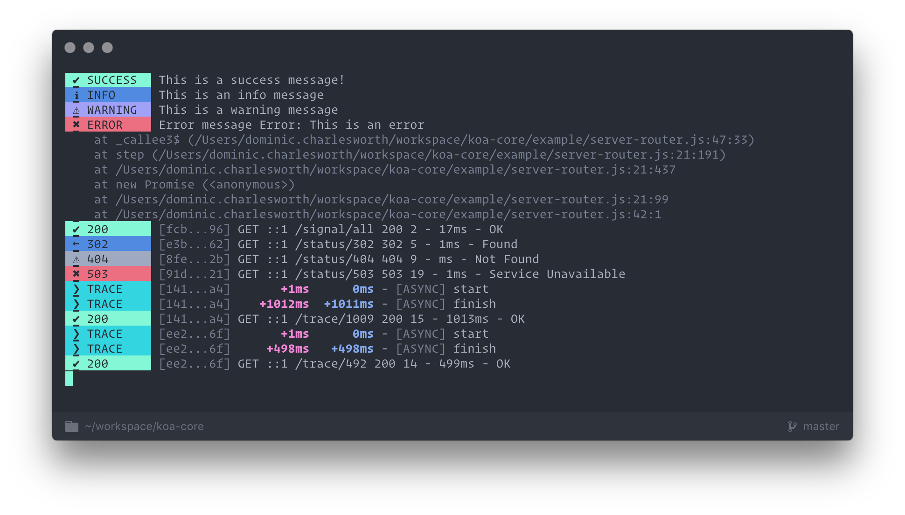

<h1 align="center">Koa Signal</h1>

<p align="center">
  <i>
    A hackable & configurable console logger designed to integrate
    perfectly with <b>@uswitch/koa</b> libraries
  </i>
</p>

<p align="center">
  <b><a href="#overview">Overview</a></b>
  |
  <b><a href="#usage">Usage</a></b>
  |
  <b><a href="#api">Api</a></b>
  |
  <b><a href="#configuration">Configuration</a></b>
  |
  <b><a href="#contributors">Contributors</a></b>
</p>


<p align="center">
  
</p>


[](#contributors)
[]()


[](https://facebook.github.io/jest/)
p[](https://standardjs.com)

## Overview

This package is a library inspired by
[**Signale**](https://github.com/klauscfhq/signale), to provide
customisable and consistent logging for **Node*** services.

It tries to address the following;

* 🍽 **Comletely Customisable** - Control everything with a single JSON file
* 📏 **Extensible** - Add your own **signals** and components

This allows you to create **consistent** logs decoupled
from the actual implementation of your code.

---

### Usage

`koa-signal` was designed to work seamlessly with
[`@uswitch/koa-access`](https://github.com/uswitch/koa-access) &
[`@uswitch/koa-tracer`](https://github.com/uswitch/koa-tracer). If you
use _either_ of these, you can just plug it in like so;

```js
import Koa from 'koa'

import Signal from '@uswitch/koa-signal'
import access, { eventAccess } from '@uswitch/koa-access'
import tracer, { eventTrace, eventError } from '@uswitch/koa-tracer'

const app = new Koa()
const signal = Signal({ /* Config overrides */ })

app.use(tracer())
app.use(access())

app.on(eventAccess, signal.access)
app.on(eventTrace, ({ ctx,key,trace }) => signal.trace({ ...ctx, ...trace, scope: key }))
app.on(eventError, ({ ctx, error }) => signal.error(ctx, error.original))


app.listen(3000, () => signal.start(Listening on port 3000))
```
<p align="center"><i><b>N.B.</b> See <a
href="https://github.com/uswitch/koa-core">
koa-core</a></i></p>

However, you can use it entirely independently of these two libraries
as a log formatter. Creating an instance of `koa-signal` will provide
you with a bunch of different logging functions, _e.g._

```js
import Signal from '@uswitch/koa-signal'
const signal = Signal({ /* config overrides */ })

signal.info('My really useful info message')
```

#### Production _vs_ Development

`koa-signal`'s formatting is useful for logging in **Development** to
give a good understanding of what's happening in your application,
however, in **Production** you probably want your output to be
_machine readable_.

To change the formatting for **Production**, you can just provide a
_new_ config file, _e.g._

```js
import Signal from '@uswitch/koa-signal'
const signal = Signal({
  levels: {
    info: { format: [] },
    trace: { format: [] },
    warn: { format: [] },
    error: { format: [] },
    access: { format: [ json ] }
  },
  components: {
    json: { properties: [ 'id', 'errors', 'errorsCount', 'traces' ] }
  }
})
```
<p align="center"><i><b>N.B.</b> See <a
href="https://github.com/uswitch/koa-core">
koa-core</a></i></p>


### API

Each **Signal** function is defined with a `format` property [_(See
configuration)_](#configuration) which dictates how the log **output**
is built. For example, let's take the `trace` function with the
following output;

```
🤦 Doh!   [9ee...498] | +2546ms | |  +123ms | [SCOPE] >  First scoped traced message
```

The whole output is a **LEVEL**, but is made up of multiple
**COMPONENTS**;
```
                                  TRACE LEVEL FUNCTION
╭──────────────────────────────────────────┴────────────────────────────────────────╮
🤦 Doh!   [9ee...498] | +2546ms | |  +123ms | [SCOPE] >  First scoped traced message
╰───┬───╯ ╰────┬────╯ ╰────┬────╯ ╰────┬────╯ ╰────┬────╯╰─────────────┬────────────╯
COMPONENT  COMPONENT   COMPONENT   COMPONENT   COMPONENT           COMPONENT
```

This is defined in config as the following;
```json
{
  "levels": {
    "trace": {
      "badge": "🤦",
      "label": "Doh!",
      "format": [ "level", "id", "time-diff-init", "time-diff-scope", "scope", "message" ]
    }
  }
}
```
Where `[ "level", ..., "message" ]` is the list of **Components**
being used. **Components** also have their _own_ configuration defined separately.

#### API Functions

These functions are available _by default_ and require the following
properties when called.

| Function  | API                                                                                             |
|-----------|-------------------------------------------------------------------------------------------------|
| `success` | `({ state: { id: STRING }, msg: STRING })`                                                      |
| `info`    | `({ state: { id: STRING }, msg: STRING })`                                                      |
| `warn`    | `({ state: { id: STRING }, msg: STRING })`                                                      |
| `access`  | `({ state: { id: STRING }, req: OBJECT, res: OBJECT }, extras: OBJECT)`                         |
| `trace`   | `({ state: { id: STRING }, initDiff: INT, timeDiff: INT, scope: STRING, msg: STRING })`         |
| `zipkin`  | `({ kind: CLIENT/SERVER, state: { parent: STRING, trace: STRING }, req: OBJECT, res: OBJECT })` |
| `error`   | `({ state: { id: STRING }, msg: STRING }, ERROR)`                                               |
| `start`   | `({ msg: SRTING })`                                                                             |
| `end`     | `({ msg: STRING })`                                                                             |

### Configuration

You can see the default configuration of [`koa-signal` here](https://github.com/uswitch/koa-signal/blob/master/src/koa-signal.defaults.json)


## Contributors

Thanks goes to these wonderful people ([emoji key](https://github.com/kentcdodds/all-contributors#emoji-key)):

<!-- ALL-CONTRIBUTORS-LIST:START - Do not remove or modify this section -->
| [<br /><sub>Dom Charlesworth</sub>](http://domcharlesworth.co.uk)<br />[📖](https://github.com/uswitch/koa-access/commits?author=domtronn "Documentation") [💻](https://github.com/uswitch/koa-access/commits?author=domtronn "Code") [🤔](#ideas-domtronn "Ideas, Planning, & Feedback") [🔌](#plugin-domtronn "Plugin/utility libraries") | [<br /><sub>David Annez</sub>](http://davidannez.com)<br />[💻](https://github.com/uswitch/koa-access/commits?author=annez "Code") [🤔](#ideas-annez "Ideas, Planning, & Feedback") [🔌](#plugin-annez "Plugin/utility libraries") |
| :---: | :---: |
<!-- ALL-CONTRIBUTORS-LIST:END -->

This project follows the [all-contributors](https://github.com/kentcdodds/all-contributors) specification. Contributions of any kind welcome!


