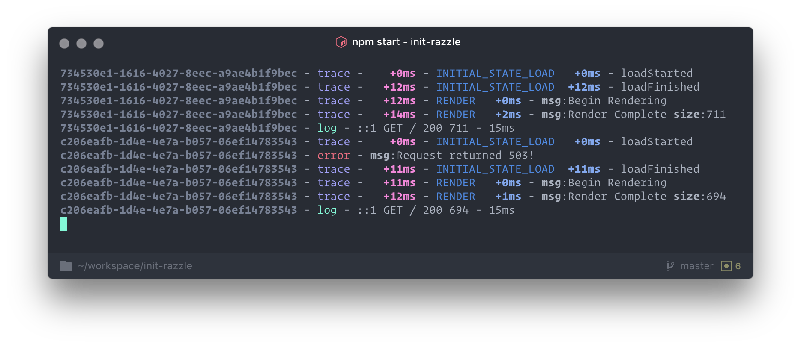

<h1 align="center">Koa Tracer</h1>

<p align="center">
  <i>
    A <b><a href="http://koajs.com">Koa</a></b> middleware for
    tracing your request's lifecycle, <b>efficiently</b> & <b>effectively</b>.
  </i>
</p>

<p align="center">
  <b><a href="#overview">Overview</a></b>
  |
  <b><a href="#usage">Usage</a></b>
  |
  <b><a href="#api">Api</a></b>
</p>


<p align="center">
  
</p>


## Overview

This package is a [**Koa**](http://koajs.com/) middleware to allow
**tracing** the lifecycle of requests.

It tries to implement the following features;

* 📚 **Namespaced traces** - _Group messages by namespace_
* ⏱ **Namespaced relative time diffs** - _Display the time difference in
  `ms` between events in a namespace._
* 🌍 **Global relative time diffs** - _Display time difference
between request start and the trace event._
* 🐛 **Decoupled errors** - _Log errors separately to handling
  them._
* 🏆 **Per-request trace** - _Be able to reference all
  traces back to a single request!_

All of this is designed to make it **easy** to rebuild an exact
picture of what's happening in your code.

---

### Usage

```js
import Koa from 'koa'
import tracer from 'koa-tracer'

const app = new Koa()

app.use(tracer())

app.on('koa-tracer:trace', Logger.log)
app.on('koa-tracer:error', Logger.err)
```

This package uses [**Event
Emitters**](https://nodejs.org/api/events.html) to decouple the
handling of **runtime** tracing and logging. This means that you can
decide how you want to handle traces and errors separately with the
`koa-tracer:trace` & `koa-tracer:error` events.

However, all traces and errors are available in **Koa's** context at
the end of the request to be used in **access logs**, or whatever else you
might want.

#### Functions

##### `trace` - `fn (ctx, &optional namespace, message)`

* `ctx [Object]` - the **Koa** `ctx` object
* `namespace [String]` - A namespace for the trace message _(optional)_
* `message [String/Object]` - The details of the trace message

##### `traceError` - `fn (ctx, err)`

* `ctx [Object]` - the **Koa** `ctx` object
* `err [String/Object/Error]` - The details of the error

### API

#### Objects

A **trace** object looks like this;

```js
{
  "time": "Date"       // Date for when that trace was logged
  "timeDiff": 12       // Diff in `ms` between this and the first trace in namspace
  "initDiff": 30       // Diff in `ms` between this and start of request
  "msg": "Foo bar"     // The message passed into the trace
  [other properties]   // Any other properties passed in
}
```

An **error** object looks like this;

```js
{
  "time": "Date"       // Date for when that error was logged
  "msg": "Foo bar"     // The message passed into the error
  [other properties]   // Any other properties passed in
}
```

The **state** object, after a request, looks like this;

```js
{
  "traceStart": "Date" /* Date when the request started */
  "trace": {
    "__general": [ /* List of traces without namespace */ ],
    "namespace": [ /* List of traces in `namespace` */ ]
  }

  "errorsCount": 12  /* The number of errors occured in this request */
  "errors": [
    /* List of errors */
  ]
}
```

#### Events

The following events are fired on `trace` and `error` logging
completion.

* `koa-tracer:trace => ({ ctx, key, trace })`
* `koa-tracer:error => ({ ctx, error })`

_**N.B.** These events are called with **Objects**_

They can be imported from the `koa-tracer` module, as

```js
import { eventTrace, eventError } from 'koa-tracer'
```
